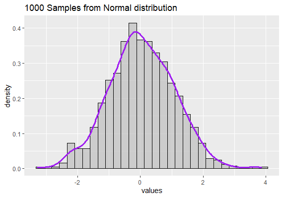
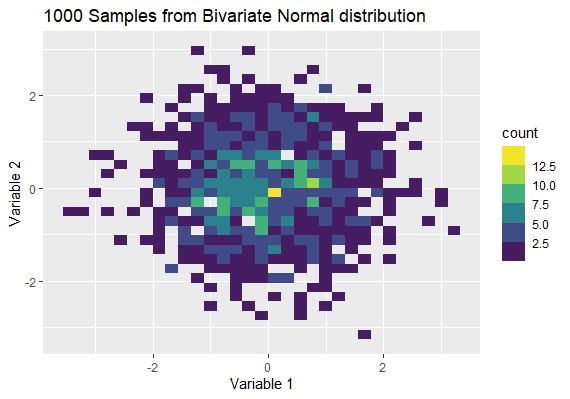

 ```{css echo=FALSE}
.left-column {
  float: left;
  width: 50%;
}
.right-column {
  float: right;
  width: 50%;
}
.pull-right ~ p {
  clear: both;
}
    ```

```{r setup, include=FALSE}
options(htmltools.dir.version = FALSE)
knitr::opts_chunk$set(
  fig.width=9, fig.height=3.5, fig.retina=3,
  out.width = "100%",
  cache = FALSE,
  echo = TRUE,
  message = FALSE, 
  warning = FALSE,
  hiline = TRUE
)
```

```{r xaringan-themer, include=FALSE, warning=FALSE}
library(xaringanthemer)
style_duo_accent(
  primary_color = "#EB8D1A",
  secondary_color = "#FF961C",
  inverse_header_color = "#FFFFFF"
)
```

## Introduction

Normal distribution shows everywhere in our life. For observing what the values my emerge in our real world, I simulation 100 samples from **N(0, 1)** and get 100 pairs from **bivariate normal distribution with the mean vector (0, 0) as well as covariance identity matrix**. Then, visualize these data points by ggplot packages. Here is my code.
```{r, include = FALSE}
# packages
library(tidyverse)
library(ggplot2)
library(MASS)

# One Dimension Normal Distribution
normalSamples <- rnorm(1000, 0, 1)
graphNorm <- data.frame(sample = normalSamples) %>% ggplot(aes(x = normalSamples)) +
  geom_histogram(aes(y = ..density..), bins = 30, colour='black', fill='gray', alpha = 0.7)+
  labs(title = "1000 Samples from Normal distribution",
       x = "values") + 
  geom_density(colour = "purple", lwd = 1.3, alpha = 0.3)

# Two Dimension Normal Distribution
muVector <- c(0, 0)
covMatrix <- matrix(c(1, 0, 0, 1), nrow = 2)
bivariateSample <- mvrnorm(n = 1000, muVector, covMatrix)
df <- data.frame(x = bivariateSample[,1], y = bivariateSample[,2])
graphBivar <- df %>% ggplot(aes(x=x, y=y) ) +
  geom_bin2d() + scale_fill_binned(type = "viridis") +
  labs(title = "1000 Samples from Bivariate Normal distribution",
       x = "Variable 1",
       y = "Variable 2") 
```

[Normal samples](#Normal_samples)


[Normal graph](#Normal_graph)


[Bivariate samples](#Bivariate_samples)


[Bivariate graph](#Bivariate_graph)


---
name: Normal_samples

## Normal Samples

- show 5 of 100 samples 
```{r}
print(normalSamples[1:5])
```

---

name: Normal_graph

## Normal Graph
.left-column[
Although normal distribution is symmetric, it doesn't mean our sample must be falls apart from x =0 equal. As we see in this graph, this distribution is slightly skew.
]
.right-column[

]

---

name: Bivariate_samples

## Bivariate Samples


- show 5 of 100 samples 
```{r}
print(bivariateSample[1:5,])
```

---

name: Bivariate_graph

## Bivariate Graph


.left-column[
This setting of bivariate normal distribution makes the 1000 points easily center at the coordinate (0, 0) and the dispersion of y axis 0 is similar to that of x axis. In this graph, the sample has verify this think.
]
.right-column[



]

